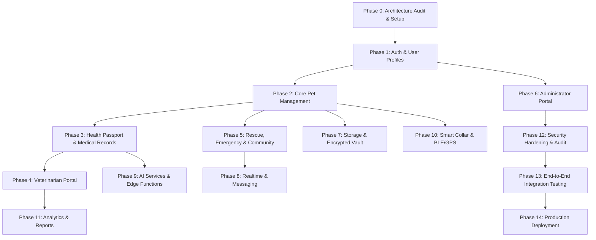

# PetConnect AI — Backend Architecture Audit & Phased Implementation Roadmap

**Project**: PetConnect AI  
**Frontend**: Flutter (Riverpod, GoRouter, M3 Custom Theming)  
**Backend**: Supabase (PostgreSQL, Auth, Storage, Realtime, Edge Functions)  
**Live Stitch Source**: 11980148222920456950  
**Target Repository**: `D:\Downloads\Pet_Connect_Ai\petconnect_ai`  
**Git Branch**: `master` (Latest Commit: `bcd10d57e245d562bb2fb083cde7b72110768078`)  

---

## 1. Executive Summary

PetConnect AI is a multi-portal pet care ecosystem comprising **96 fully-implemented functional UI screens** spanning four distinct user personas: **Pet Owners**, **Veterinarians**, **Volunteer & Rescue Personnel**, and **System Administrators**.

The Flutter presentation and UI layer is 100% complete and visually reconciled against Stitch specifications in both Light and Dark themes. The current application state runs on local mock data and stubbed controllers.

This document establishes the authoritative, production-grade **Supabase Backend Architecture** and a **15-Phase Phased Implementation Roadmap**. Each phase is self-contained, test-verifiable, and designed to incrementally transition the client from mock state to real backend infrastructure without breaking existing UI contracts.

---

## 2. Authoritative Screen Reconciliation

### 2.1 Reconciled Screen Counts
The application contains exactly **96 functional UI screens**, divided across product portals as follows:

| Portal / Category | Reconciled Screen Count | Primary Scope |
|---|---|---|
| **Authentication & Onboarding** | **8** | Splash, Onboarding, Login, Register, Forgot Password, Role Selection, OTP, Welcome |
| **Pet Owner Portal** | **52** | Home, Pets, Health Passport, AI Hub, Smart Collar, Community, Profile, Settings |
| **Veterinarian Portal** | **12** | Vet Dashboard, Queue, Appointments, Patient Records, Consultations, Prescriptions, Pharmacy, Clinic, Profile |
| **Volunteer & Rescue Portal** | **15** | Mission Dashboard, Active Ops, EOC, Rescue Requests, Reports, History, Network, Profile, Settings |
| **Administrator Portal** | **9** | User Management, Moderation, Security Center, Health, Audit Logs, Reports, Staff, Content, Settings |
| **TOTAL** | **96** | **100% Functional UI Coverage** |

> [!NOTE]
> `InitialPetSetupScreen` (`/pet-setup`) and `GlobalSearchScreen` (`/search` / `/owner/search`) are classified under the Pet Owner Portal (part of the 52 Pet Owner screens). `VetProfileScreen` is part of the 12 Veterinarian Portal screens.

---

## 3. Codebase & Supabase Architecture Audit

### 3.1 Codebase Structure
The codebase follows Clean Architecture with feature-first modularization:

```
lib/
├── app.dart                      # Root MaterialApp.router setup
├── bootstrap.dart                # Dependency initialization & Supabase.initialize()
├── main.dart                     # Entry point calling bootstrap()
├── core/
│   ├── config/                   # AppConfig, Env validation, Flavor definitions
│   ├── error/                    # AppException, Failure hierarchy, FailureMapper
│   ├── network/                  # NetworkInfo, DioClient for external REST
│   ├── providers/                # AppConfig, SupabaseClient, SharedPreferences providers
│   ├── theme/                    # AppTheme, AppColors, PortalPalettes, M3 Tokens
│   └── utils/                    # AppLogger, Validators, Extension helpers
├── router/
│   ├── app_router.dart           # GoRouter graph registering all 96 route paths
│   ├── route_guard.dart          # Centralized route guard (permissive stub)
│   ├── route_observer.dart       # Route logging observer
│   └── route_paths.dart          # Canonical String constants for paths and names
├── shared/
│   ├── data/                     # Base Model & DataSource interfaces
│   ├── domain/                   # Base Entity & Repository contracts
│   └── widgets/                  # Shared UI components (Buttons, Cards, Avatars, Inputs)
└── features/
    ├── auth/                     # Authentication & Onboarding (Data, Domain, Presentation)
    ├── pet_owner/                # Pet Owner Portal (52 Screens)
    ├── veterinarian/             # Veterinarian Portal (12 Screens)
    ├── volunteer_rescue/         # Volunteer & Rescue Portal (15 Screens)
    └── administrator/            # Administrator Portal (9 Screens)
```

### 3.2 Current Readiness Metrics
- **UI Implementation**: 100% (96/96 screens complete and reconciled)
- **Supabase SDK Integration**: Installed (`supabase_flutter: ^2.9.0`) & initialized in `bootstrap.dart`
- **Environment Configuration**: Safe `.env` loading via `flutter_dotenv` & `AppConfig`
- **Auth Data Layer**: `AuthRemoteDataSource`, `AuthSessionModel`, `AuthRepositoryImpl` implemented
- **Domain Contracts**: `AuthRepository`, `AuthSession`, core UseCases implemented
- **Backend Database Schemas & RLS**: 0% (Needs deployment in Supabase)
- **Storage Buckets**: 0% (Needs creation & policy configuration)
- **Realtime / Edge Functions**: 0% (Needs deployment)

---

## 4. Complete 96-Screen Backend Requirement Mapping

| # | Portal | Screen Name | Route Path | Current Status | Required Tables | Storage / Realtime / AI / Telemetry | Auth Role Required | Phase |
|---|---|---|---|---|---|---|---|---|
| 1 | Auth | Splash | `/` | Mock | `profiles` | - | Public | Phase 1 |
| 2 | Auth | Onboarding | `/onboarding` | Mock | - | Local SharedPrefs | Public | Phase 1 |
| 3 | Auth | Login | `/login` | Partial | `profiles` | Supabase Auth | Public | Phase 1 |
| 4 | Auth | Create Account | `/register` | Partial | `profiles` | Supabase Auth | Public | Phase 1 |
| 5 | Auth | Forgot Password | `/forgot-password` | Mock | - | Supabase Auth Email | Public | Phase 1 |
| 6 | Auth | Role Selection | `/role-selection` | Mock | `profiles` | Supabase Auth Metadata | Public | Phase 1 |
| 7 | Auth | OTP Verification | `/verify-otp` | Mock | `profiles` | Supabase Auth OTP | Public | Phase 1 |
| 8 | Auth | Welcome Success | `/welcome` | Mock | `profiles` | - | Authenticated | Phase 1 |
| 9 | Owner | Initial Pet Setup | `/pet-setup` | Mock | `pets` | Storage (Pet Photo) | Pet Owner | Phase 2 |
| 10 | Owner | Global Search | `/search` | Mock | `pets`, `vet_clinics`, `rescue_missions` | Global Search Indexes | Pet Owner | Phase 2 |
| 11 | Owner | Home Dashboard | `/owner` | Mock | `pets`, `health_records`, `user_notifications` | Storage (Pet Avatar) | Pet Owner | Phase 2 |
| 12 | Owner | Notifications | `/owner/notifications` | Mock | `user_notifications` | Realtime (Push/In-App) | Pet Owner | Phase 8 |
| 13 | Owner | My Pets List | `/owner/pets` | Mock | `pets` | Storage (Pet Avatars) | Pet Owner | Phase 2 |
| 14 | Owner | Add Pet | `/owner/pets/add` | Mock | `pets` | Storage (Pet Photo) | Pet Owner | Phase 2 |
| 15 | Owner | Pet Profile Detail | `/owner/pets/:petId` | Mock | `pets`, `health_records` | Storage (Photos) | Pet Owner | Phase 2 |
| 16 | Owner | Edit Pet Profile | `/owner/pets/:petId/edit` | Mock | `pets` | Storage (Photo Upload) | Pet Owner | Phase 2 |
| 17 | Owner | Pet Settings | `/owner/pets/:petId/settings` | Mock | `pets`, `pet_settings` | - | Pet Owner | Phase 2 |
| 18 | Owner | Delete Pet Confirmation | `/owner/pets/:petId/delete` | Mock | `pets` | Soft Delete Trigger | Pet Owner | Phase 2 |
| 19 | Owner | Pet Media Gallery | `/owner/pets/:petId/gallery` | Mock | `pet_gallery_media` | Storage (Photos/Videos) | Pet Owner | Phase 7 |
| 20 | Owner | Pet Sharing | `/owner/pets/sharing` | Mock | `pet_sharing_permissions` | - | Pet Owner | Phase 5 |
| 21 | Owner | Lost Pet Dashboard | `/owner/lost-dashboard` | Mock | `lost_pet_alerts`, `lost_pet_sightings` | Realtime, Storage | Pet Owner | Phase 5 |
| 22 | Owner | Activate Lost Mode | `/owner/lost-mode` | Mock | `lost_pet_alerts` | Realtime Alert Broadcast | Pet Owner | Phase 5 |
| 23 | Owner | Health Passport Dashboard | `/owner/health` | Mock | `health_records`, `vaccinations` | Storage (Medical Files) | Pet Owner | Phase 3 |
| 24 | Owner | Medical History Record | `/owner/health/medical` | Mock | `health_records` | Storage (PDF/Docs) | Pet Owner | Phase 3 |
| 25 | Owner | Vaccination Overview | `/owner/health/vaccinations` | Mock | `vaccinations` | Storage (Certificates) | Pet Owner | Phase 3 |
| 26 | Owner | Health Passport Timeline | `/owner/health/timeline` | Mock | `health_timeline_events` | - | Pet Owner | Phase 3 |
| 27 | Owner | Growth & Weight Analytics | `/owner/health/growth` | Mock | `pet_weight_logs` | Recharts / Aggregations | Pet Owner | Phase 3 |
| 28 | Owner | Pet Documents Vault | `/owner/health/vault` | Mock | `pet_documents` | Storage (Encrypted Vault) | Pet Owner | Phase 7 |
| 29 | Owner | Treatment Plan | `/owner/health/treatment` | Mock | `treatment_plans`, `prescriptions` | - | Pet Owner | Phase 3 |
| 30 | Owner | AI Hub Dashboard | `/owner/ai` | Mock | `ai_conversations`, `ai_health_insights` | AI Service | Pet Owner | Phase 9 |
| 31 | Owner | AI Assistant Chat | `/owner/ai/chat` | Mock | `ai_chat_messages` | Edge Function (Gemini API) | Pet Owner | Phase 9 |
| 32 | Owner | AI Health Insights | `/owner/ai/insights` | Mock | `ai_health_insights` | Edge Function (Analysis) | Pet Owner | Phase 9 |
| 33 | Owner | AI Recommendations | `/owner/ai/recommendations` | Mock | `ai_health_insights` | Edge Function | Pet Owner | Phase 9 |
| 34 | Owner | AI Reports | `/owner/ai/reports` | Mock | `ai_conversations` | Storage (PDF Reports) | Pet Owner | Phase 9 |
| 35 | Owner | AI History | `/owner/ai/history` | Mock | `ai_conversations` | - | Pet Owner | Phase 9 |
| 36 | Owner | AI Health Analysis | `/owner/ai/analysis` | Mock | `ai_health_scans` | Storage (Symptom Photo) | Pet Owner | Phase 9 |
| 37 | Owner | AI Diagnostic Center | `/owner/ai/diagnostic` | Mock | `ai_health_scans` | Edge Function | Pet Owner | Phase 9 |
| 38 | Owner | AI Scan & Identify | `/owner/ai/scan` | Mock | `ai_health_scans` | Storage (Camera Image) | Pet Owner | Phase 9 |
| 39 | Owner | Smart Collar Dashboard | `/owner/collar` | Mock | `smart_collars`, `collar_activity_summaries` | BLE / GPS Telemetry | Pet Owner | Phase 10 |
| 40 | Owner | Smart Collar Tracking | `/owner/collar/tracking` | Mock | `collar_gps_locations` | Realtime Location Stream | Pet Owner | Phase 10 |
| 41 | Owner | Smart Collar Activity | `/owner/collar/activity` | Mock | `collar_activity_summaries` | Telemetry Aggregation | Pet Owner | Phase 10 |
| 42 | Owner | Smart Collar Geofence | `/owner/collar/geofence` | Mock | `geofences` | Spatial PostGIS / Alerts | Pet Owner | Phase 10 |
| 43 | Owner | Smart Collar Diagnostics | `/owner/collar/diagnostics` | Mock | `smart_collars` | BLE Connection Metrics | Pet Owner | Phase 10 |
| 44 | Owner | Smart Collar Settings | `/owner/collar/settings` | Mock | `smart_collars` | BLE Pair Configuration | Pet Owner | Phase 10 |
| 45 | Owner | Community Hub | `/owner/community` | Mock | `community_posts` | Storage (Post Images) | Pet Owner | Phase 5 |
| 46 | Owner | Create Post | `/owner/community/create-post` | Mock | `community_posts` | Storage (Media Upload) | Pet Owner | Phase 5 |
| 47 | Owner | Discover Feed | `/owner/community/discover` | Mock | `community_posts`, `post_comments` | - | Pet Owner | Phase 5 |
| 48 | Owner | Local Community | `/owner/community/local` | Mock | `community_posts` | Location Queries | Pet Owner | Phase 5 |
| 49 | Owner | Community Sightings | `/owner/community/sightings` | Mock | `lost_pet_sightings` | Storage, Realtime Maps | Pet Owner | Phase 5 |
| 50 | Owner | Lost & Found Community | `/owner/community/lost-found` | Mock | `lost_pet_alerts` | Realtime Map Markers | Pet Owner | Phase 5 |
| 51 | Owner | Community Events | `/owner/community/events` | Mock | `community_posts` | Storage (Event Covers) | Pet Owner | Phase 5 |
| 52 | Owner | Pet Adoption | `/owner/community/adoption` | Mock | `community_posts` | Storage (Pet Gallery) | Pet Owner | Phase 5 |
| 53 | Owner | Community Messages | `/owner/community/messages` | Mock | `direct_messages` | Realtime Chat | Pet Owner | Phase 8 |
| 54 | Owner | Community Search | `/owner/community/search` | Mock | `community_posts`, `profiles` | Full-Text Search | Pet Owner | Phase 5 |
| 55 | Owner | Community Badges | `/owner/community/achievements` | Mock | `user_achievements` | - | Pet Owner | Phase 5 |
| 56 | Owner | Saved Content | `/owner/community/saved` | Mock | `saved_posts` | - | Pet Owner | Phase 5 |
| 57 | Owner | Live Activity Feed | `/owner/community/live-feed` | Mock | `community_posts` | Realtime Feed Stream | Pet Owner | Phase 8 |
| 58 | Owner | Profile | `/owner/profile` | Mock | `profiles` | Storage (Avatar/Cover) | Pet Owner | Phase 1 |
| 59 | Owner | Settings | `/owner/settings` | Mock | `profiles` | - | Pet Owner | Phase 1 |
| 60 | Vet | Vet Dashboard | `/vet` | Mock | `appointments`, `vw_patient_queue` | Realtime Queue Metrics | Veterinarian | Phase 4 |
| 61 | Vet | Patient Queue | `/vet/queue` | Mock | `vw_patient_queue` | Realtime Status Updates | Veterinarian | Phase 4 |
| 62 | Vet | Today's Appointments | `/vet/appointments` | Mock | `appointments` | - | Veterinarian | Phase 4 |
| 63 | Vet | Appointment Management | `/vet/appointments/schedule` | Mock | `appointments`, `vet_schedules` | Calendar Sync | Veterinarian | Phase 4 |
| 64 | Vet | Patient Registry | `/vet/patients` | Mock | `pets`, `profiles` | - | Veterinarian | Phase 4 |
| 65 | Vet | Patient Medical Record | `/vet/patients/:patientId` | Mock | `health_records`, `vaccinations` | Storage (Clinical Docs) | Veterinarian | Phase 4 |
| 66 | Vet | Consultation Workspace | `/vet/consultation/:appointmentId` | Mock | `consultations` | Storage (Clinical Notes) | Veterinarian | Phase 4 |
| 67 | Vet | Digital Prescription | `/vet/prescription/create` | Mock | `prescriptions` | PDF Export / Edge Fn | Veterinarian | Phase 4 |
| 68 | Vet | Vet Treatment Plan | `/vet/treatment-plan` | Mock | `treatment_plans` | - | Veterinarian | Phase 4 |
| 69 | Vet | Clinic Management | `/vet/clinic` | Mock | `vet_clinics`, `clinic_staff` | Storage (Clinic Logo) | Veterinarian | Phase 4 |
| 70 | Vet | Inventory & Pharmacy | `/vet/pharmacy` | Mock | `pharmacy_inventory` | - | Veterinarian | Phase 4 |
| 71 | Vet | Clinic Analytics | `/vet/analytics` | Mock | `mv_clinic_analytics` | Aggregate SQL Views | Veterinarian | Phase 11 |
| 72 | Vet | Vet Profile | `/vet/profile` | Mock | `profiles` | Storage (License/Avatar) | Veterinarian | Phase 4 |
| 73 | Rescue | Mission Dashboard | `/rescue` | Mock | `rescue_missions` | Realtime Map Operations | Volunteer/Rescue | Phase 5 |
| 74 | Rescue | Active Rescue Operations | `/rescue/operations` | Mock | `rescue_missions` | Realtime Telemetry | Volunteer/Rescue | Phase 5 |
| 75 | Rescue | Nearby Rescue Requests | `/rescue/requests` | Mock | `vw_nearby_rescue_requests` | Location PostGIS Query | Volunteer/Rescue | Phase 5 |
| 76 | Rescue | Emergency Ops Center | `/rescue/eoc` | Mock | `rescue_missions` | Realtime Incident Feed | Volunteer/Rescue | Phase 5 |
| 77 | Rescue | Rescue Community Reports | `/rescue/reports` | Mock | `lost_pet_sightings` | Storage (Evidence Photos) | Volunteer/Rescue | Phase 5 |
| 78 | Rescue | Mission Details | `/rescue/missions/:missionId` | Mock | `rescue_missions` | Storage, Realtime Status | Volunteer/Rescue | Phase 5 |
| 79 | Rescue | Mission Accepted | `/rescue/missions/:missionId/accepted` | Mock | `rescue_missions` | Realtime GPS Tracking | Volunteer/Rescue | Phase 5 |
| 80 | Rescue | Mission Completed | `/rescue/missions/:missionId/completed` | Mock | `rescue_missions` | Storage (Outcome Photos) | Volunteer/Rescue | Phase 5 |
| 81 | Rescue | Rescue History | `/rescue/history` | Mock | `rescue_missions` | - | Volunteer/Rescue | Phase 5 |
| 82 | Rescue | Volunteer Network | `/rescue/network` | Mock | `profiles` | Location Distance Search | Volunteer/Rescue | Phase 5 |
| 83 | Rescue | Volunteer Profile | `/rescue/profile` | Mock | `profiles`, `user_achievements` | Storage (Avatar/ID) | Volunteer/Rescue | Phase 5 |
| 84 | Rescue | Volunteer Achievements | `/rescue/achievements` | Mock | `user_achievements` | - | Volunteer/Rescue | Phase 5 |
| 85 | Rescue | Volunteer Assistance | `/rescue/assistance` | Mock | `rescue_missions` | - | Volunteer/Rescue | Phase 5 |
| 86 | Rescue | Pet Sharing Permissions | `/rescue/sharing` | Mock | `pet_sharing_permissions` | Audit Log Integration | Volunteer/Rescue | Phase 5 |
| 87 | Rescue | Volunteer Settings | `/rescue/settings` | Mock | `profiles` | - | Volunteer/Rescue | Phase 5 |
| 88 | Admin | Admin User Management | `/admin` | Mock | `profiles` | User Lock / Role Updates | Administrator | Phase 6 |
| 89 | Admin | Community Moderation | `/admin/moderation` | Mock | `community_posts` | - | Administrator | Phase 6 |
| 90 | Admin | Security Center | `/admin/security` | Mock | `audit_logs` | Realtime Threat Feed | Administrator | Phase 6 |
| 91 | Admin | Platform Health | `/admin/health` | Mock | `platform_metrics` | Edge Metrics Collector | Administrator | Phase 6 |
| 92 | Admin | Audit Logs | `/admin/audit-logs` | Mock | `audit_logs` | Immutable Audit View | Administrator | Phase 6 |
| 93 | Admin | Platform Reports | `/admin/reports` | Mock | `mv_platform_reports` | Aggregate Materialized Views | Administrator | Phase 6 |
| 94 | Admin | Staff Management | `/admin/staff` | Mock | `clinic_staff`, `profiles` | Admin Role Assignment | Administrator | Phase 6 |
| 95 | Admin | Content Management | `/admin/content` | Mock | `community_posts` | Storage (Banners) | Administrator | Phase 6 |
| 96 | Admin | Platform Settings | `/admin/settings` | Mock | `profiles` | System Flags | Administrator | Phase 6 |

---

## 5. Complete Database Table Inventory

Every database entity referenced by the 96 screens is classified into one of seven architectural categories below.

### A. Core Physical Tables (16)
1. `profiles`: User account details, full name, application role (`pet_owner`, `veterinarian`, `volunteer_rescue`, `administrator`), email, avatar URL. Primary Key: `id` (FK -> `auth.users.id`).
2. `pets`: Pet master catalog (name, species, breed, dob, weight, microchip_id). FK: `owner_id` -> `profiles.id`.
3. `health_records`: Clinical medical notes, conditions, allergies, surgical history. FK: `pet_id` -> `pets.id`.
4. `vaccinations`: Vaccine details, batch numbers, administered date, expiration date, certificate URL. FK: `pet_id` -> `pets.id`.
5. `treatment_plans`: Prescribed treatment protocols and schedules. FK: `pet_id` -> `pets.id`.
6. `vet_clinics`: Registered veterinary clinics, address, license info, contact. FK: `owner_vet_id` -> `profiles.id`.
7. `appointments`: Vet appointment bookings and time slots. FKs: `pet_id`, `clinic_id`, `vet_id`.
8. `consultations`: SOAP notes and clinical records from consultations. FK: `appointment_id` -> `appointments.id`.
9. `prescriptions`: Digital prescriptions issued by veterinarians. FK: `consultation_id` -> `consultations.id`.
10. `pharmacy_inventory`: Clinic medication stocks and pharmacy items. FK: `clinic_id` -> `vet_clinics.id`.
11. `lost_pet_alerts`: Active lost pet alerts, last seen GPS location, contact info. FK: `pet_id` -> `pets.id`.
12. `lost_pet_sightings`: Community sighting reports for lost pets. FK: `alert_id` -> `lost_pet_alerts.id`.
13. `rescue_missions`: Emergency rescue operations and field missions. FK: `alert_id` -> `lost_pet_alerts.id`.
14. `smart_collars`: Smart collar hardware device registry, MAC address, battery level. FK: `pet_id` -> `pets.id`.
15. `community_posts`: Community posts, adoption listings, announcements, local news. FK: `author_id` -> `profiles.id`.
16. `audit_logs`: Immutable security and administrative audit trail. FK: `actor_id` -> `profiles.id`.

### B. Supporting Physical Tables (12)
17. `pet_gallery_media`: Media assets (photos/videos) uploaded to a pet's gallery. FK: `pet_id` -> `pets.id`.
18. `pet_documents`: Uploaded vault files (lab tests, insurance PDFs). FK: `pet_id` -> `pets.id`.
19. `pet_settings`: Individual pet preference flags (notifications, privacy). FK: `pet_id` -> `pets.id`.
20. `pet_weight_logs`: Historical weight & growth telemetry entries. FK: `pet_id` -> `pets.id`.
21. `health_timeline_events`: Unified health passport timeline log events. FK: `pet_id` -> `pets.id`.
22. `vet_schedules`: Vet shift availability and working hours. FK: `vet_id` -> `profiles.id`.
23. `clinic_staff`: Staff member assignments per clinic. FKs: `clinic_id`, `staff_id`.
24. `collar_gps_locations`: GPS coordinate telemetry logs. FK: `collar_id` -> `smart_collars.id`.
25. `geofences`: Safe-zone polygon boundary definitions. FK: `collar_id` -> `smart_collars.id`.
26. `collar_activity_summaries`: Daily activity/rest telemetry logs. FK: `collar_id` -> `smart_collars.id`.
27. `direct_messages`: 1-on-1 community chat messages. FKs: `sender_id`, `recipient_id`.
28. `user_notifications`: User in-app notifications and alerts. FK: `user_id` -> `profiles.id`.

### C. Join / Association Tables (5)
29. `pet_sharing_permissions`: Shares pet access between owners, co-owners, & caretakers. FKs: `pet_id`, `grantee_id`.
30. `saved_posts`: Bookmarked community posts. FKs: `user_id`, `post_id`.
31. `post_comments`: Comments on community posts. FKs: `post_id`, `author_id`.
32. `post_reactions`: Likes and reactions on community posts. FKs: `post_id`, `user_id`.
33. `user_achievements`: Achievements & badges unlocked by users/volunteers. FKs: `user_id`, `badge_id`.

### D. Database Views (3)
34. `vw_active_lost_pets`: Active lost pet alerts with latest sighting counts and map coordinates.
35. `vw_patient_queue`: Today's clinic appointment queue formatted for vet dashboards.
36. `vw_nearby_rescue_requests`: Open rescue requests within geographic distance boundaries.

### E. Materialized Views (2)
37. `mv_clinic_analytics`: Daily/monthly aggregated clinic revenue, appointment volume, and patient stats.
38. `mv_platform_reports`: Platform-wide growth metrics, operational reports, and system usage.

### F. Derived / AI & Telemetry State (4)
39. `ai_conversations`: Persisted AI assistant chat session metadata. FK: `user_id` -> `profiles.id`.
40. `ai_chat_messages`: Message history per AI conversation session. FK: `conversation_id` -> `ai_conversations.id`.
41. `ai_health_scans`: Multimodal image analysis scan records. FK: `user_id` -> `profiles.id`.
42. `platform_metrics`: System health & performance metrics gathered via Edge Function cron jobs.

### G. Future Table Candidates (Not in Current Scope) (2)
43. `payment_transactions` (Future Phase — Monetization/Billing).
44. `insurance_claims` (Future Phase — Third-party insurance integrations).

---

### Table Inventory Totals Summary
- **Core Physical Tables**: 16
- **Supporting Physical Tables**: 12
- **Join/Association Tables**: 5
- **TOTAL PHYSICAL TABLES**: **33**
- **Database Views**: 3
- **Materialized Views**: 2
- **Derived / AI / System Tables**: 4
- **Future Consideration Tables**: 2

---

## 6. Role & Authorization Architecture

- **Supabase Auth**: Manages identity authentication, password security, JWT issuance, email verification, and session token renewal.
- **`profiles` Table**: Holds the application user profile and the authoritative, server-enforced application role (`pet_owner`, `veterinarian`, `volunteer_rescue`, `administrator`).
- **Database Row Level Security (RLS)**: Enforces database authorization for every SQL query and API invocation. Client queries cannot read or write unauthorized data even if API calls are forged.
- **GoRouter `RouteGuard`**: Operates **strictly as a client-side UX navigation helper** to redirect users away from unauthenticated or cross-portal routes. It is **NOT a security boundary**. Changing client-side state cannot bypass database RLS policies.

---

## 7. Row Level Security (RLS) Strategy & Role Protection

All database tables have RLS explicitly enabled (`ALTER TABLE <table> ENABLE ROW LEVEL SECURITY;`).

| Table Category | Anonymous | Authenticated Pet Owner | Veterinarian | Volunteer / Rescue | Administrator |
|---|---|---|---|---|---|
| `profiles` | READ (Public info) | READ/UPDATE (Own profile*) | READ/UPDATE (Own profile*) | READ/UPDATE (Own profile*) | READ/UPDATE (All profiles) |
| `pets` | NONE | READ/INSERT/UPDATE/DELETE (Own pets) | READ (Assigned patients) | READ (Lost/Rescue pets) | READ/DELETE (All) |
| `health_records` | NONE | READ/INSERT/UPDATE (Own pets) | READ/INSERT/UPDATE (Active patients) | NONE | READ (Audit) |
| `vaccinations` | NONE | READ (Own pets) | READ/INSERT/UPDATE (Authorized vet) | NONE | READ (Audit) |
| `vet_clinics` | READ | READ | READ/UPDATE (Own clinic) | READ | READ/UPDATE/DELETE |
| `appointments` | NONE | READ/INSERT/CANCEL (Own) | READ/UPDATE/COMPLETE (Own clinic) | NONE | READ (Audit) |
| `prescriptions` | NONE | READ (Own pet prescriptions) | READ/INSERT/UPDATE (Treating vet) | NONE | READ (Audit) |
| `lost_pet_alerts` | READ | READ/INSERT/UPDATE (Own alert) | READ | READ/UPDATE (Active mission) | READ/UPDATE/DELETE |
| `rescue_missions` | READ | READ (Own pet mission) | READ | READ/INSERT/UPDATE (Assigned) | READ/UPDATE/DELETE |
| `smart_collars` | NONE | READ/INSERT/UPDATE (Own collar) | NONE | READ (During active lost mode) | READ/UPDATE |
| `community_posts` | READ | READ/INSERT/UPDATE/DELETE (Own) | READ/INSERT/UPDATE/DELETE (Own) | READ/INSERT/UPDATE/DELETE (Own) | READ/DELETE (Moderation) |
| `audit_logs` | NONE | NONE | NONE | NONE | READ ONLY |

*\*Note: Standard users may update permitted profile fields (full_name, avatar_url, phone), but CANNOT modify `role` due to the database trigger below.*

### 7.1 Database-Enforced Role Escalation Prevention Trigger

Standard RLS `FOR UPDATE USING (auth.uid() = id)` allows users to update rows they own, but does not natively prevent mutating the `role` column. To prevent unauthorized role elevation (e.g. `pet_owner` -> `administrator`), a server-side PostgreSQL trigger enforces column-level security:

```sql
-- Trigger Function: Abort update if non-admin attempts to mutate role column
CREATE OR REPLACE FUNCTION public.prevent_profile_role_escalation()
RETURNS TRIGGER AS $$
BEGIN
  IF NEW.role IS DISTINCT FROM OLD.role THEN
    IF NOT EXISTS (
      SELECT 1 FROM public.profiles 
      WHERE id = auth.uid() AND role = 'administrator'
    ) THEN
      RAISE EXCEPTION 'Unauthorized: Standard users cannot alter their application role.';
    END IF;
  END IF;
  RETURN NEW;
END;
$$ LANGUAGE plpgsql SECURITY DEFINER;

-- Attach trigger BEFORE UPDATE on profiles table
CREATE OR REPLACE TRIGGER enforce_profile_role_protection
  BEFORE UPDATE ON public.profiles
  FOR EACH ROW
  EXECUTE FUNCTION public.prevent_profile_role_escalation();
```

---

## 8. Supabase Storage Architecture

Storage buckets are configured with file size limits, MIME type validations, and security access policies:

1. `pet-avatars` (Public Bucket): Photos of pets. Max file size: 5 MB. Allowed MIME: `image/jpeg`, `image/png`, `image/webp`.
2. `user-avatars` (Public Bucket): Profile photos of users. Max file size: 5 MB. Allowed MIME: `image/*`.
3. `community-media` (Public Bucket): Post attachments, community event banners. Max file size: 15 MB.
4. `health-documents` (Private Bucket): Encrypted medical records, lab reports, insurance PDFs. Max file size: 25 MB. Accessible only via short-lived **Signed URLs** (`createSignedUrl`) generated for pet owners or treating vets.
5. `vaccination-certificates` (Private Bucket): Digital vaccination certificates. Signed URLs only.
6. `rescue-evidence` (Public/Restricted Bucket): Incident photos uploaded during lost pet sightings or rescue operations. Max file size: 10 MB.

> [!IMPORTANT]
> Private storage buckets using short-lived Signed URLs enforce access control at the HTTP/API level. They do **not** imply client-side payload encryption unless payload encryption is applied prior to upload. Sensitive medical documents are restricted via storage RLS policies and Signed URLs.

---

## 9. Complete Phased Implementation Roadmap



---

### Phase Breakdown & Definitions of Done

#### Phase 0: Backend Setup & Environment Verification
- **Purpose**: Verify Supabase project credentials, configure environment configurations (`dev`, `staging`, `prod`), and validate Riverpod DI overrides in `bootstrap.dart`.
- **Database Changes Required**: No.
- **Deliverables**: Verified `AppConfig`, active Supabase project connection, updated `.env.example`.
- **Complexity**: LOW

#### Phase 1: Authentication + Session + User Profiles + Roles [DEPLOYED & VERIFIED ON LIVE SUPABASE]
- **Purpose**: Implement real Supabase authentication, session persistence across restarts, user profile creation (`public.profiles`), role authorization (`pet_owner`, `veterinarian`, `volunteer_rescue`, `administrator`), and auth-aware GoRouter route guards (`RouteGuard`).
- **Screens**: 1–8 (Auth), 58 (Profile), 59 (Settings).
- **Tables Created/Modified**: `profiles` (with RLS policies enabled).
- **Deliverables**: Real sign in, sign up, sign out, password recovery, OTP verification, `profiles` RLS policies, reactive `GoRouterRefreshStream`, unit tests passing.
- **Status**: COMPLETE & DEPLOYED (Live Project: `cghgslyikjqghrzhrqxz`)
- **Complexity**: MEDIUM

#### Phase 2: Core Pet Management [DEPLOYED & VERIFIED ON LIVE SUPABASE]
- **Purpose**: Build pet profile CRUD, species catalog, pet settings, and global pet search.
- **Screens**: 9 (My Pets), 10 (Add Pet), 11 (Pet Profile Detail), 13 (Edit Pet Profile), 14 (Delete Pet Confirmation), 15 (Pet Settings), 16 (Pet Media Gallery), 17 (Pet Sharing), 18 (Initial Pet Setup).
- **Tables Created/Modified**: `pets`, `pet_settings` (with owner RLS policies & anti-spoofing triggers).
- **Deliverables**: Real pet roster list, add/edit/delete pet flow, selected pet switching, pet settings persistence, RLS security, 23 unit tests passing.
- **Status**: COMPLETE & DEPLOYED (Live Project: `cghgslyikjqghrzhrqxz`)
- **Complexity**: MEDIUM

#### Phase 3: Pet Health Passport & Medical Data
- **Purpose**: Persist medical records, vaccination logs, health timeline events, growth analytics, and treatment plans.
- **Screens**: 23–27, 29.
- **Tables Created/Modified**: `health_records`, `vaccinations`, `health_timeline_events`, `pet_weight_logs`, `treatment_plans`.
- **Deliverables**: Real health passport data, growth trend charts, treatment schedules.
- **Complexity**: HIGH

#### Phase 4: Veterinarian Portal Backend
- **Purpose**: Support clinic management, patient registry, appointment scheduling, consultation workspace, digital prescriptions, and pharmacy inventory.
- **Screens**: 60–70, 72.
- **Tables Created/Modified**: `vet_clinics`, `appointments`, `consultations`, `prescriptions`, `pharmacy_inventory`, `vet_schedules`, `clinic_staff`, `vw_patient_queue`.
- **Deliverables**: Vet appointment management, prescription creator, patient registry access.
- **Complexity**: VERY HIGH

#### Phase 5: Volunteer & Rescue Operations + Community
- **Purpose**: Lost pet mode activation, sighting reports, emergency rescue mission dispatch, community feed, local events, and adoption listings.
- **Screens**: 20–22, 45–52, 54–57, 73–87.
- **Tables Created/Modified**: `lost_pet_alerts`, `lost_pet_sightings`, `rescue_missions`, `community_posts`, `saved_posts`, `post_comments`, `post_reactions`, `user_achievements`, `vw_active_lost_pets`, `vw_nearby_rescue_requests`.
- **Deliverables**: Realtime lost pet alerts, rescue mission dashboard, community posts & events.
- **Complexity**: VERY HIGH

#### Phase 6: Administrator Portal Backend
- **Purpose**: System user management, role modification, content moderation queue, security threat center, platform health metrics, and audit log viewer.
- **Screens**: 88–96.
- **Tables Created/Modified**: `audit_logs`, `platform_metrics`.
- **Deliverables**: Admin management tools, moderation workflows, immutable audit logging.
- **Complexity**: HIGH

#### Phase 7: Storage & Encrypted Vault
- **Purpose**: Configure Supabase storage buckets, upload policies, image compression, and private document vault signed URLs.
- **Screens**: 19, 28.
- **Tables Created/Modified**: `pet_gallery_media`, `pet_documents`.
- **Buckets Created**: `pet-avatars`, `user-avatars`, `community-media`, `health-documents`, `vaccination-certificates`, `rescue-evidence`.
- **Deliverables**: File upload repositories, media gallery, encrypted document vault access.
- **Complexity**: MEDIUM

#### Phase 8: Realtime & Notifications
- **Purpose**: Deploy Supabase Realtime channels for in-app messaging, rescue ops, and Firebase Cloud Messaging for push alerts.
- **Screens**: 12, 53.
- **Tables Created/Modified**: `user_notifications`, `direct_messages`.
- **Deliverables**: Chat messaging system, realtime push notifications.
- **Complexity**: HIGH

#### Phase 9: AI Services & Edge Functions
- **Purpose**: Deploy Supabase Edge Functions integrating Gemini API for AI chat, multimodal symptom scans, health reports, and diagnostic recommendations.
- **Screens**: 30–38.
- **Tables Created/Modified**: `ai_conversations`, `ai_chat_messages`, `ai_health_scans`.
- **Deliverables**: Server-side AI Edge Functions, streaming chat UI, visual symptom analyzer.
- **Complexity**: VERY HIGH

#### Phase 10: Smart Collar + BLE / GPS Telemetry
- **Purpose**: BLE pairing interface, telemetry ingestion endpoint, live GPS location mapping, and geofence polygon boundary checks.
- **Screens**: 39–44.
- **Tables Created/Modified**: `smart_collars`, `collar_gps_locations`, `geofences`, `collar_activity_summaries`.
- **Deliverables**: Telemetry ingest service, PostGIS geofence breach detection, map tracking.
- **Complexity**: VERY HIGH

#### Phase 11: Analytics & Reports
- **Purpose**: Create PostgreSQL materialized views and aggregation functions for vet clinic analytics and platform reporting.
- **Screens**: 71, 93.
- **Database Views Created**: `mv_clinic_analytics`, `mv_platform_reports`.
- **Deliverables**: Performant SQL aggregation views, clinic revenue & patient volume charts.
- **Complexity**: MEDIUM

#### Phase 12: Security Hardening & Audit Review
- **Purpose**: Comprehensive security audit, RLS policy penetration testing, service key leak checks, secret scanning, and rate limiting setup.
- **Database Changes Required**: No new tables; RLS policy hardening.
- **Deliverables**: Verified zero-vulnerability audit, finalized RLS rules.
- **Complexity**: HIGH

#### Phase 13: End-to-End Integration Testing
- **Purpose**: Execute test suite across Windows Desktop and Web (Edge), validating end-to-end user journeys across all 4 portals.
- **Database Changes Required**: No.
- **Deliverables**: 100% passing test suite covering Auth, Repositories, RLS, and Router Guards.
- **Complexity**: MEDIUM

#### Phase 14: Production Deployment & Monitoring
- **Purpose**: Production database migration deployment, Edge function release, SSL/domain configuration, error logging (Sentry/Logger).
- **Database Changes Required**: Production migration apply.
- **Deliverables**: Production launch readiness.
- **Complexity**: HIGH

---

## 10. Standard Definition of Done (DoD)

A phase is considered COMPLETE only when:
1. Applicable database tables, enums, triggers, and RLS policies are applied in Supabase.
2. Data sources and repository implementations pass all unit tests (`flutter test`).
3. Targeted UI mocks are replaced with live Riverpod provider data.
4. `flutter analyze --no-fatal-infos` yields 0 errors, 0 warnings, 0 info lints.
5. Manual verification passes on Microsoft Edge (`flutter run -d edge`) and Windows (`flutter run -d windows`).
6. Changes are committed to Git with a descriptive commit message and pushed to `origin/master`.
